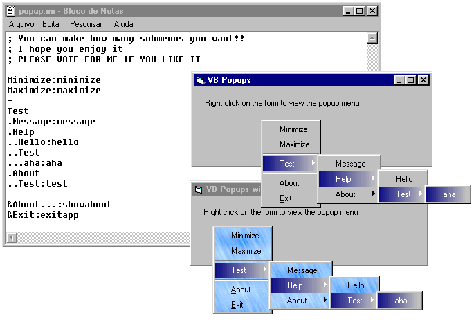



## Popup Menu with a file\(Like mIRC\)\(MUST SEE\)\(UNLIMITED SUBMENUS NO DLL\)

### Description

It is an example how to make a popup menu using a file (popup.ini) like mIRC. This code is fully commented. I'VE ADDED SUPPORT TO UNLIMITED SUBMENUS AND SUPPORT TO BACKGROUND.

I'VE INCLUDED THE SOURCE OF SSUBTMR.DLL IN THIS

PROJECT. SO IT ISN'T USING DLLS.

THIS IS A GREAT CODE GUYS.

PLEASE VOTE FOR ME IF YOU LIKE IT. AND LEAVE A FEEDBACK.
 
### More Info
 

             |
---                |---
**Submitted On**   |2001-09-30 21:40:50
**By**             |[Frederico Machado](https://github.com/Planet-Source-Code/PSCIndex/blob/master/ByAuthor/frederico-machado.md)
**Level**          |Intermediate
**User Rating**    |4.8 (154 globes from 32 users)
**Compatibility**  |VB 6\.0
**Category**       |[Custom Controls/ Forms/  Menus](https://github.com/Planet-Source-Code/PSCIndex/blob/master/ByCategory/custom-controls-forms-menus__1-4.md)
**World**          |[Visual Basic](https://github.com/Planet-Source-Code/PSCIndex/blob/master/ByWorld/visual-basic.md)
**Archive File**   |[Popup Menu273061012001\.zip](https://github.com/Planet-Source-Code/frederico-machado-popup-menu-with-a-file-like-mirc-must-see-unlimited-submenus-no-dll__1-27599/archive/master.zip)

